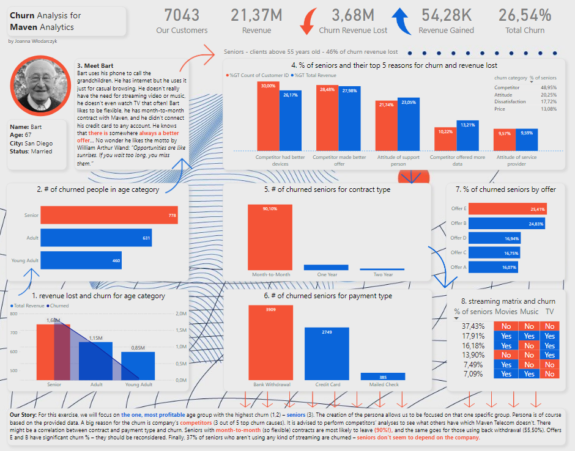

#### -- Project Status: [Completed]

# Telecom-Customer-Churn

## About the project

### Purpose

The purpose of this analysis is to explore reasons for churn in the company.
For this exercise, I focused on the one, most profitable age group with the highest churn – seniors. The creation of the persona allows in general to be focused on that one specific group. Persona is based on the provided data.

### Conclusion

- A big reason for the churn is company's competitors (3 out of 5 top churn causes). It is advised to perform competitors’ analyses to see what others have which Maven Telecom doesn’t.
- There might be a correlation between contract and payment type and churn. Seniors with month-to-month (so flexible) contracts are most likely to leave (90%!), and the same goes for those using back withdrawal (55,50%).
- Offers E and B have significant churn % – they should be reconsidered.
- Finally, 37% of seniors who aren’t using any kind of streaming are churned – seniors don’t seem to depend on the company.

### Dataset

Dataset was provided by https://www.mavenanalytics.io/

### Methods Used

- Statistics
- Data Visualization
- DAX
- Data Cleaning
- Persona Creation

### Built With

- [PowerBi](https://powerbi.microsoft.com/)
- [DAX](https://docs.microsoft.com/en-us/dax/)

(<a href="#top">back to top</a>)

## Contact

Joanna Wlodarczyk - [@linkedin](https://www.linkedin.com/in/joannawlodarczyk/)

Project Link: [https://github.com/JMWlodarczyk/PS4-Games-Sales-Dashboard](https://github.com/JMWlodarczyk/PS4-Games-Sales-Dashboard)

(<a href="#top">back to top</a>)

## Credits

Background image was taken from https://www.freepik.com/
